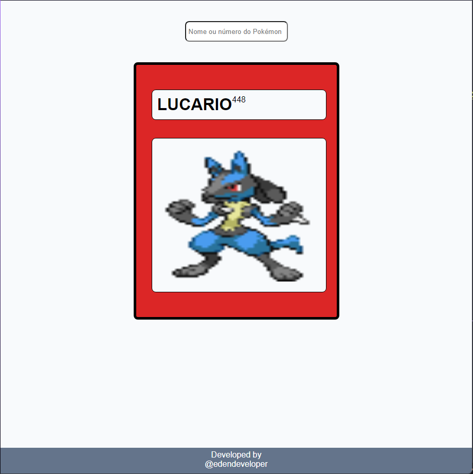

<h1 align="center"> Pokédex </h1>

  <a href="#-tecnologias">Tecnologias</a>&nbsp;&nbsp;&nbsp;|&nbsp;&nbsp;&nbsp;
  <a href="#-projeto">Projeto</a>&nbsp;&nbsp;&nbsp;|&nbsp;&nbsp;&nbsp;
  <a href="#memo-licença">Licença</a>

  

 

  

## 🚀 Tecnologias

Esse projeto foi desenvolvido com as seguintes tecnologias:

- HTML e CSS
- JavaScript
- Git e Github

## 💻 Projeto

Uma imitação da Pokédex, que faz requisições na PokéAPI e retorna pro usuário as informações do pokémon desejado.

- [Visite o projeto online](https://edendeveloper.github.io/pokedex/)
- [Visite a PokéAPI](https://pokeapi.co)

## :memo: Licença

Esse projeto está sob a licença MIT.

---